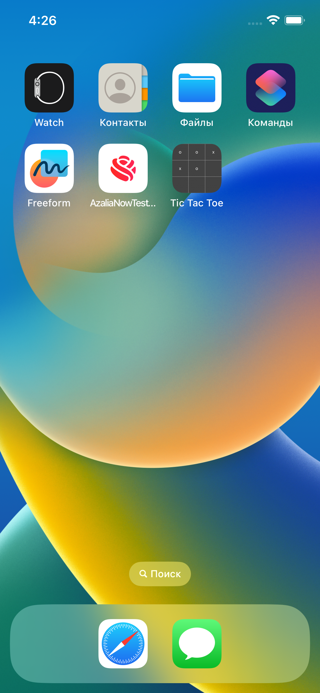

# Tic Tac Toe / Xs and Os 

Old but gold game for 2 players.

## Table of Contents 
* [General Info](#general-info)
* [Setup](#setup)
* [Screenshots](#screenshots)

## General Info
### Game Rules

Tic-tac-toe is played on a three-by-three grid by two players, who alternately place the marks X and O in one of the nine spaces in the grid.

### About Application 

Game starts after user opens the application. By default, first turn of the very first game on Os. 

## Setup

To run this project, ensure that your environment meets the requirements by running this command:
```
flutter doctor
```
If you have any issues, read the [official documentation](https://docs.flutter.dev/get-started/editor)

To run the project on Simulator, you have number of ways to quickly select and switch between devices:

1. Clicking on the currently selected device in the status bar
2. Executing the ```Flutter: Select Device``` command
3. Pressing your custom key binding for the ```Flutter: Select Device``` command

More information is available by [current link](https://docs.flutter.dev/get-started/test-drive)

## Screenshots

The application successfully builds on both iOS and Android Simulators. First two screenchots - iOS, then Android's one.
<div style="display: flex;">


</div>

### Random Quotes
If game ends with draw, both players wouldn't get any score for the game. In the modal box motivative quotes would be displayed. The 1 of 5 quotes whould be drawn randomly. 
<div style="display: flex;">


</div>

### Launcher Icons
I haven't been wasting time by drawing launcher icons. I have cropped the screenshot with filled cells and made its copies in different sizes. For Android, I've additionally created round icons. 
<div style="display: flex;">


</div>
